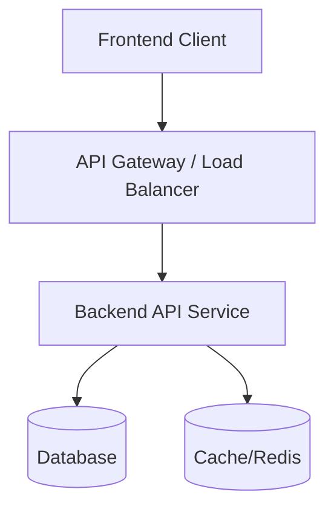

# Architecture Design

This document details the system architecture, component relationships, and tech stack of the platform.

## Overview

The application follows a decoupled client-server architecture:

## Tech Stack

- **Frontend**: Next.js / React, CSS Modules
- **Backend**: Node.js / Express or similar API Framework
- **Database**: PostgreSQL / MongoDB
- **Caching**: Redis
