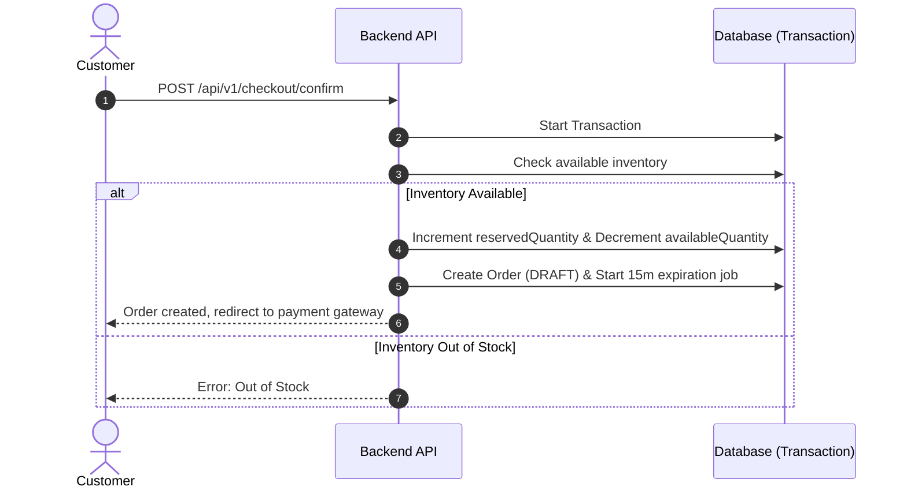

# Production Ecommerce Backend Playbook

A reusable architectural blueprint and implementation guide for building secure, high-performance, production-ready ecommerce backends. 

---

## 1. Authentication Component (Double-Token JWT + Google OAuth)

### Architecture Schema
* **Access Token**: Short-lived (15m), stored in-memory (e.g. client state manager). Sent via `Authorization: Bearer <token>` header.
* **Refresh Token**: Long-lived (7d), stored in a secure, `httpOnly`, `sameSite: "strict"`, `secure` cookie. Only accessible on path `/api/v1/auth/refresh`.
* **Refresh Token Rotation (RTR)**: Each request to refresh rotates both tokens. If a previously-invalidated/used refresh token is presented, revoke all sessions immediately.

### Code Templates

#### Access & Refresh Token Generator
```typescript
import jwt from "jsonwebtoken";

interface TokenPayload {
  userId: string;
  email: string;
  role: string;
}

export function generateTokens(payload: TokenPayload) {
  const accessToken = jwt.sign(payload, process.env.JWT_ACCESS_SECRET!, {
    expiresIn: "15m",
  });
  const refreshToken = jwt.sign(payload, process.env.JWT_REFRESH_SECRET!, {
    expiresIn: "7d",
  });
  return { accessToken, refreshToken };
}
```

#### Authentication Middleware
```typescript
import { Request, Response, NextFunction } from "express";
import jwt from "jsonwebtoken";
import { ApiError } from "../exceptions/api-error.js";

export function requireAuth(req: Request, res: Response, next: NextFunction) {
  const authHeader = req.headers.authorization;
  if (!authHeader || !authHeader.startsWith("Bearer ")) {
    return next(ApiError.unauthorized("Access token required."));
  }

  const token = authHeader.split(" ")[1];
  try {
    const decoded = jwt.verify(token, process.env.JWT_ACCESS_SECRET!) as any;
    req.user = decoded; // Attach user context to request
    next();
  } catch (error) {
    return next(ApiError.unauthorized("Invalid or expired access token."));
  }
}
```

---

## 2. Cart & Pricing Component (Live Pricing Pattern)

> [!CRITICAL]
> **Live Cart Calculation**:
> Never store item prices in the `cart` database table. Users can easily manipulate client-side payloads, or prices might change while items sit in the cart.
> At checkout/render time, resolve variant IDs against the live database, compile the prices, and write the locked price to `OrderItem` records only after payment is verified.

### Live Cart Price Resolver Schema
```typescript
import prisma from "../config/db.js";

export async function getCartTotal(userId: string) {
  const cartItems = await prisma.cart.findMany({
    where: { userId },
    include: {
      variant: {
        select: {
          price: true,
          discountPrice: true,
        },
      },
    },
  });

  return cartItems.reduce((acc, item) => {
    const finalPrice = item.variant.discountPrice || item.variant.price;
    return acc + Number(finalPrice) * item.quantity;
  }, 0);
}
```

---

## 3. Inventory Component (15-Minute Checkout Stock Lock)

To prevent double-selling and handle inventory reservations cleanly under heavy traffic:



### Transactional Stock Reservation Template
```typescript
import prisma from "../config/db.js";
import { ApiError } from "../exceptions/api-error.js";

export async function reserveInventory(variantId: string, quantity: number) {
  return await prisma.$transaction(async (tx) => {
    const inventory = await tx.inventory.findUnique({
      where: { variantId },
    });

    if (!inventory || inventory.availableQuantity < quantity) {
      throw ApiError.badRequest("Insufficient stock available.");
    }

    // Move stock from available to reserved
    return await tx.inventory.update({
      where: { variantId },
      data: {
        availableQuantity: { decrement: quantity },
        reservedQuantity: { increment: quantity },
      },
    });
  });
}
```

---

## 4. Payment Component (Razorpay Webhook Validation)

> [!WARNING]
> **Webhook Signature Verification**:
> Never update order status based on a frontend success callback alone.
> Use Razorpay webhook listeners matching the raw request buffer to prevent payment spoofing.

### Webhook Verification Code Template
```typescript
import crypto from "crypto";
import { Request, Response } from "express";
import prisma from "../config/db.js";

export async function handlePaymentWebhook(req: Request, res: Response) {
  const signature = req.headers["x-razorpay-signature"] as string;
  const webhookSecret = process.env.RAZORPAY_WEBHOOK_SECRET!;
  
  // Use raw request body buffer for HMAC generation
  const expectedSignature = crypto
    .createHmac("sha256", webhookSecret)
    .update(req.body) 
    .digest("hex");

  if (expectedSignature !== signature) {
    return res.status(400).send("Invalid signature.");
  }

  const event = JSON.parse(req.body.toString());
  if (event.event === "payment.captured") {
    const providerOrderId = event.payload.payment.entity.order_id;
    
    // Commit database changes: capture payment and confirm order
    await prisma.$transaction(async (tx) => {
      const payment = await tx.payment.findFirst({
        where: { providerOrderId },
      });
      if (payment) {
        await tx.payment.update({
          where: { id: payment.id },
          data: { status: "SUCCESSFUL", paidAt: new Date() },
        });
        await tx.order.update({
          where: { id: payment.orderId },
          data: { status: "CONFIRMED" },
        });
      }
    });
  }

  res.status(200).json({ received: true });
}
```

---

## 5. Shipping & Fulfillment (Carrier API Strategy)

Standardizing integrations with carriers like Delhivery or Shiprocket.

### Shipping Service Interface
```typescript
export interface ShippingRateRequest {
  originPincode: string;
  destinationPincode: string;
  weightGrams: number;
}

export interface ShippingLabelRequest {
  orderNumber: string;
  recipientName: string;
  recipientPhone: string;
  addressLine: string;
  pincode: string;
  weightGrams: number;
}

export class ShippingCarrierClient {
  private apiKey: string;
  private baseUrl: string;

  constructor() {
    this.apiKey = process.env.SHIPPING_API_KEY!;
    this.baseUrl = process.env.SHIPPING_BASE_URL!;
  }

  // Check serviceability and cost
  async checkServiceability(pincode: string): Promise<boolean> {
    // API GET call to carrier checking service availability
    return true;
  }

  // Register package for pick up, get Air Waybill (AWB) tracking id
  async generateAWB(details: ShippingLabelRequest): Promise<{ awb: string; labelUrl: string }> {
    // API POST call to carrier registering shipment
    return { awb: "AWB123456789", labelUrl: "https://carrier.com/labels/123.pdf" };
  }
}
```

---

## 6. Pre-Production Simulation & Testing Patterns

### A. High-Concurrency Stock Check Test (Node.js)
```typescript
import axios from "axios";

async function simulateTraffic() {
  const variantId = "some-variant-uuid";
  const requests = Array.from({ length: 50 }).map(() =>
    axios.post("http://localhost:5000/api/v1/checkout/confirm", {
      variantId,
      quantity: 1,
    }).catch(err => err.response)
  );

  const responses = await Promise.all(requests);
  const successes = responses.filter(r => r.status === 200).length;
  const failures = responses.filter(r => r.status === 400).length;

  console.log(`Simulation complete: ${successes} checkouts succeeded, ${failures} failed.`);
}
```

### B. Tunneling Sandbox Webhooks locally
1. Install ngrok: `npm install -g ngrok`
2. Start server locally on port 5000: `npm run dev`
3. Run tunnel: `ngrok http 5000`
4. Set webhook endpoint inside payment gateway settings page to: `https://<subdomain>.ngrok-free.app/api/v1/payments/webhook`
