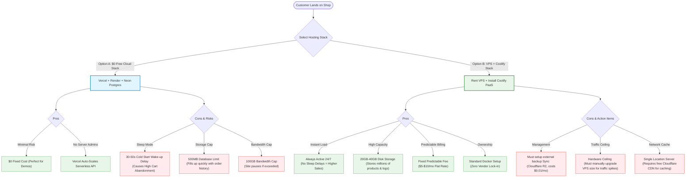

# Production Hosting Evaluation: Free Cloud Tiers vs. VPS + Coolify

This document provides a detailed business and operational comparison between hosting the E-Commerce Production platform on **Option A (Free Cloud Tiers)** versus **Option B (Self-Hosted VPS + Coolify PaaS)**. It includes a visual flow outlining the pros, cons, and customer journeys of each stack.

---

## 1. Visual Flow of Hosting Stacks (Pros & Cons Comparison)

The diagram below maps how a customer's request is handled by each stack, highlighting the business benefits and risks encountered along each path.



---

## 2. In-Depth Side-by-Side Comparison

| Metric | Option A: Free Cloud Tiers | Option B: Self-Hosted VPS + Coolify |
| :--- | :--- | :--- |
| **Initial Cost** | **$0 / month** | **$5 - $10 / month** (Hetzner, DigitalOcean) |
| **Performance (Speed)** | Variable. Render Express API sleeps after 15 mins of inactivity. First load takes 30-50s. | **Consistent & Fast.** Server never sleeps. Instant sub-second response times. |
| **Database Limit** | **500 MB** space (Neon/Supabase standard free limit). | **20 GB – 40 GB** space (limited only by VPS disk capacity). |
| **Bandwidth Limit** | **100 GB** limit on Vercel. Exceeding this pauses the storefront. | **20 TB (20,000 GB)** limit. Practically impossible to exhaust for standard stores. |
| **Vendor Lock-In** | **High.** Tied to Vercel configurations and Supabase/Neon serverless features. | **None.** Runs standard Docker containers. Can migrate hosts in under 15 minutes. |
| **Maintenance Work** | **Low.** Serverless resources are fully managed by third parties. | **Medium.** Must configure scheduled backups (automated through Coolify console). |

---

## 3. Detailed Pros & Cons Analysis

### Option A: Free Cloud Tiers (Vercel + Render + Neon)

#### 👍 The Pros:
1. **Truly Free to Start:** Zero financial barrier to launch a concept and collect feedback.
2. **Maintenance Free:** No server configurations, OS security updates, or database administration required.
3. **Automatic Scaling:** Vercel serverless routes scale dynamically during sudden traffic spikes.

#### 👎 The Cons (Business Risks):
1. **The Inactivity Delay (High Risk):** Render's free API service puts the server to sleep after 15 minutes of inactivity. When a customer lands on the page after a quiet period, the server takes **30 to 50 seconds to wake up**, which causes customers to drop off immediately.
2. **Strict Database Space Caps:** A 500MB database limit will easily exhaust in under a year once order databases, user logs, and ratings expand. Upgrading costs $19-$25/month per service.
3. **Commercial Policy Restrictions:** Vercel free plans are technically restricted to non-commercial projects.

---

### Option B: Self-Hosted VPS + Coolify (Recommended)

#### 👍 The Pros:
1. **Instant Response Times (No Sleep Mode):** The server is always online, ensuring that shopping searches, variant checkouts, and payment redirects load instantly.
2. **Complete Data Ownership:** All data sits on your own server. You are not locked into any proprietary platforms or APIs.
3. **Massive Capacity at Tiny Flat Cost:** A fixed $5-$10/month VPS delivers enough storage (20GB+) and bandwidth to support years of store transactions and millions of requests.
4. **Deploy Helper Apps for Free:** With a VPS, you can install other open-source tools via Coolify for $0 (e.g. self-hosted Web Analytics, self-hosted Image CDN, or Admin status checkers).

#### 👎 The Cons (Operational Considerations):
1. **Self-Managed Backups:** If the VPS disk fails, data is lost unless external backup sync is active. (Coolify automates sending backups to Cloudflare R2 or AWS S3, which takes 5 minutes to set up).
2. **Fixed Hardware Limits:** A single $5 VPS handles up to 5,000 daily visitors. If traffic spikes exponentially, you must click "Resize Server" inside your VPS provider dashboard to add more RAM/CPU.
3. **Requires CDN Configuration:** To get global load speeds, you must connect the server to a free Cloudflare proxy account to handle page caching and SSL.

---

## 4. Final Recommendation & Business Upgrade Roadmap

To deliver a premium brand experience that does not lose shoppers due to slow checkout delays, we recommend **Option B: VPS + Coolify**.

```
    [ Launch Phase ]                 [ Scaling Phase ]               [ High Volume Phase ]
   VPS + Coolify ($5/mo)           Upgrade VPS ($10/mo)             Cluster Deployment
   • Handles ~5,000 visitors/day   • Handles ~15,000 visitors/day   • Separate DB & Server VPS
   • Free Cloudflare CDN Active    • Expanded CPU / RAM             • Multi-region load balance
```

*For deployment architecture files, refer to:*
* [08_DEPLOYMENT_ARCHITECTURE.md](file:///c:/Users/user/Desktop/ecommerce-production/docs/08_DEPLOYMENT_ARCHITECTURE.md)
* [DEVELOPMENT_ACTIVITY_REPORT.md](file:///c:/Users/user/Desktop/ecommerce-production/docs/DEVELOPMENT_ACTIVITY_REPORT.md)
